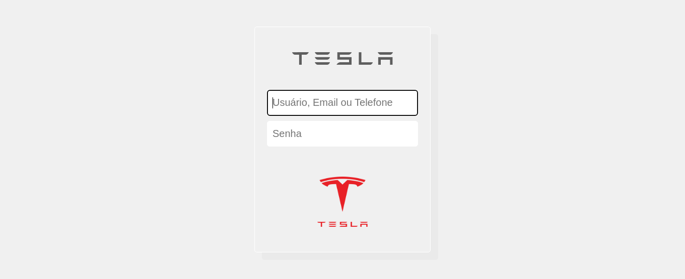

***

<h3 align="center">
    Universidade Tecnológica Federal do Paraná
</h3>
<h3 align="center">
    Tecnologia em Sistemas para Internet
</h3>
<br>
<h3 align="center">
    Programação para Dispositivos Móveis
</h3>
<h3 align="center">
    Avaliação 1.
</h3>
<br>
<h4 align="center">
    Profº. Dr. Andres Jessé Porfirio
</h4>
<h4 align="center">
    Acadêmico: André de Souza Aranda
</h4>

***

<h1 align="center">
  Aplicativo de Gerenciamento de Automóveis - TESLA.
</h1>

<p align="center">
  <a href="#-Início">Início</a>
</p>

<div align="center">
  
</div>

## 🚀 Início

- Tecnologias.

    - React 17.
    - Expo.
    - Microsoft Visual Studio Code.

- Requisitos.

    - React 17.0.1.
    - React Native 0.64.3.
    - React Native Web 0.17.1.
    - Expo 43.0.2.

- Informações para autenticação.

  - Usuário.
    
    - usuário: teste
    - senha: 123

- Instalação.

1) Descompacte o projeto.

2) Instale as dependências.

```
$ yarn install
```

3) Execute a aplicação.

```
$ yarn start
```
